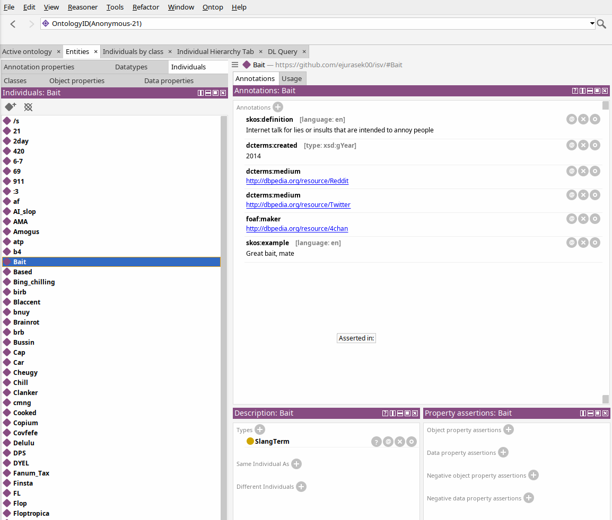
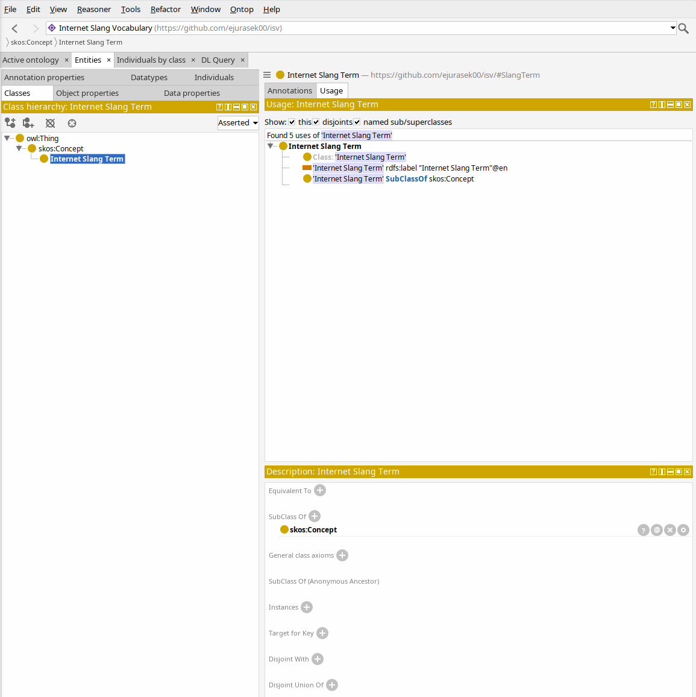
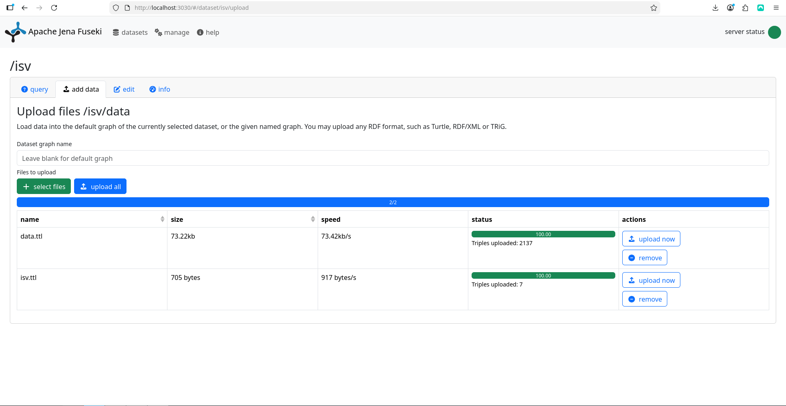
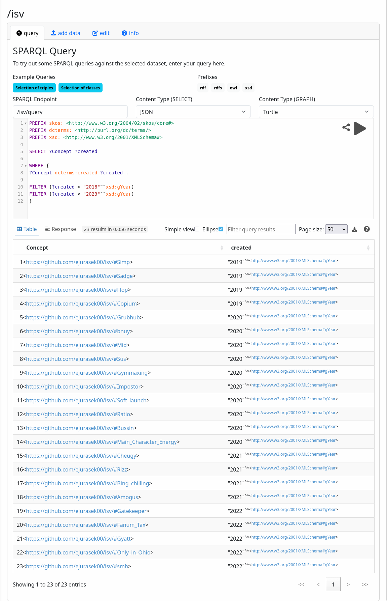

# Eduard Jurášek - Internet slang vocabulary (topic 5)

The proposed seminar project aims to implement graph database of the contemporary
Internet slang vocabulary represented in RDF. By internet slang, I refer words, phrases or
acronyms frequently used online and/or in casual speech as well.

These words have complex relationships and linguistic backstories. The graph database
is planned not only as a “word” – “meaning” principle, but include:
-Definition
-Origin
-Example in sentence
-Community usage

This project aims to make a Urban Dictionary - like database represented as a graph, but with additional perks mentioned above.
A real-world usage is to make a web UI layer and plot the results in an appealing form directly in a web browser (not yet implemented).

The development was made in a VSCode, Protege and Fuseki on a Kubuntu Linux.

---
# Words
Around 120 words are covered in .ttl
- 
- Bait
- Troll
- b4
- 2day
- brb
- OMG
- cmng
- idc
- LOL
- Only in Ohio
- Floptropica
- Wakanda
- Covfefe
- Rizz
- Bussin
- Cheugy
- Tea
- Blaccent
- Finsta
- Slaycation
- Skibidi
- AMA
- HP
- gg
- glhf
- DPS
- opp
- Karen
- NPC
- poggers
- u
- ngl
- af
- fw
- ts
- ur
- rn
- fr
- tf
- Cooked
- pfp
- Zaddy
- Goated
- Pookie
- Twin
- Honse
- Car
- Type beat
- Scrumpt
- Offed
- tbr
- atp
- GTA
- gd
- ikr
- Vibe
- smh
- yt
- Poser
- Gatekeeper
- Based
- mb
- Rule 34
- Ragebait
- 6-7
- 69
- 420
- Rule 621
- 21
- 911
- cap
- rly
- /s
- Gymmaxing
- DYEL
- op
- Frogposter
- AI slop
- r/
- omegalul
- monkaS
- Sadge
- Sus
- Amogus
- Impostor
- Copium
- pls
- Selfie
- Gigachad
- Sigma
- UwU
- OwO
- :3
- bnuy
- Birb
- Yeet
- Jet2Holiday
- Grubhub
- Bing chilling
- Clanker
- W/L
- FL
- Mid
- Peak
- Flop
- Mog
- Soft launch
- Stand
- Simp
- Delulu
- Ratio
- Main Character Energy
- Fanum Tax
- Gyatt
- Mewing
- Brainrot

The Definition and the Example in Sentence were used from https://www.urbandictionary.com/. Some parts were edited or censored.
For finding the creation dates and goups of origin, GPT-5 in a Deep Research mode was used for some parts I struggled to find manually.

---
# Using already existing ontologies

@prefix skos:   <http://www.w3.org/2004/02/skos/core#> . This is a backbone of the project and helps to describe the concept, definition and example of usage for each SlangTerm. 

@prefix foaf:   <http://xmlns.com/foaf/0.1/> . foaf:maker declares who is responsible for the origin of the SlangTerm.

@prefix dcterms:<http://purl.org/dc/terms/> . dcterms:created is used to state when was the woSlangTermrd created.

@prefix dbr:    <http://dbpedia.org/resource/> . dbr:something connects the SlangTerm to a link on DBPedia where more information about the topic can be found if someone is not familiar in the field.

@prefix xsd:    <http://www.w3.org/2001/XMLSchema#> . dcterms:created "YEAR"^^xsd:gYear;  assign year or creation of the SlangTerm as a date format.



---
# Using own ontology

I named this ontology as ISV - Internet Slang Vocabulary.

@prefix isv:    <https://github.com/ejurasek00/isv/#> . (Custom) – This ontology defines the specific class isv:SlangTerm and project metadata. 

isv:SlangTerm is a subclass of skos:Concept which is a subclass of owl:Thing.



---

# Apache Jena Fuseki

For the query part, Apache Jena Fuseki 5.6.0 on Kubuntu Linux 24.04.2 LTS was used.
I used the Web UI in Firefox using the port 3030. http://localhost:3030/

While adding data to the dataset, both data.ttl and isv.ttl are needed to be uploaded.

552 tripples were uploaded in data.ttl and 7 triples in isv.ttl



---
## Queries

Two queries were executed in Apache Jena Fuseki.

### Query 1 - Covid-19
In the first one, I was interested which of the Concepts were created during the Covid-19 Pandemic. To get the results, two filters were used: year of creation is greater than 2018 and smaller than 2023.

The query is listed below:

```
PREFIX skos: <http://www.w3.org/2004/02/skos/core#>
PREFIX dcterms: <http://purl.org/dc/terms/>
PREFIX xsd: <http://www.w3.org/2001/XMLSchema#>

SELECT ?Concept ?created

WHERE {
?Concept dcterms:created ?created .
  
FILTER (?created > "2018"^^xsd:gYear)
FILTER (?created < "2023"^^xsd:gYear)
}
```
This query found 23 entries in 0.056 seconds.

The entries were:

Simp, Sadge, Flop, Copium, Grubhub, bnuy, Mid, Sus, Gymmaxing, Impostor, Soft launch, Ratio, Bussin, Main Character Energy, Cheugy, Rizz, Bing chilling, Amogus, Gatekeeper, Fanum tax, Gyat, Only in Ohio and smh.


---

### Query 2 - Makers
In the second one one, I was interested in how many SlangTerms each maker has. Another words, I wanted to see the biggest makers first. For this, the query counted amount of occurances for each maker.

The query is listed below:

```
PREFIX isv: <https://github.com/ejurasek00/isv/#>
PREFIX skos: <http://www.w3.org/2004/02/skos/core#>
PREFIX foaf: <http://xmlns.com/foaf/0.1/>
PREFIX dcterms: <http://purl.org/dc/terms/>

SELECT ?maker (COUNT(?SlangTerm) AS ?amount)
WHERE {
  ?SlangTerm a isv:SlangTerm ;
         foaf:maker ?maker .
}
GROUP BY ?maker
ORDER BY DESC(?amount)
```
This query found 33 entries in 0.046 seconds.

The biggest SlangTerm maker is Twitter (11x), followed by TikTok (9x), Twitch (7x), SMS (7x), 4chan (5x) and the remaining ones.


---

# Related Wors

The project was inspired by a masters thesis of a friend of mine. Thank you so much, Jakub!

Riecky, J. (2025). Internet vernacular - a study of neologisms in online discourse of cybercultures [Masters Thehis, Univerzita sv. Cyrila a Metoda v Trnave FF UCM KAA]. Centrálny register záverečných a kvalifikačných prác OPAC CRZP. [https://opac.crzp.sk/?fn=detailBiblioFormChildM8GSN&sid=6F9F3F51667F0CBC3D41BFEE069E&seo=CRZP-detail-kniha](https://opac.crzp.sk/?fn=detailBiblioFormChildM8GSN&sid=6F9F3F51667F0CBC3D41BFEE069E&seo=CRZP-detail-kniha)

---
# Remarks
Having any questions or suggestions on how to make this project better, do not hesitate
to contact me via E-mail [jure01@vse.cz](mailto:jure01@vse.cz)
